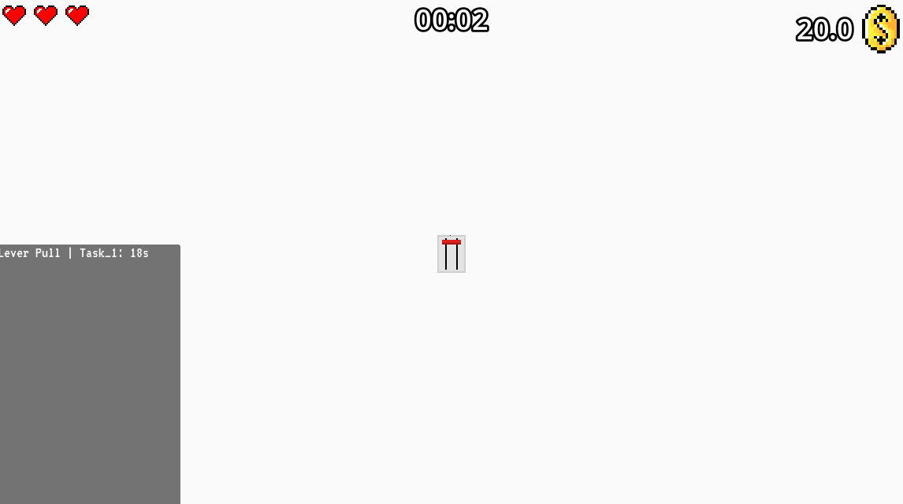
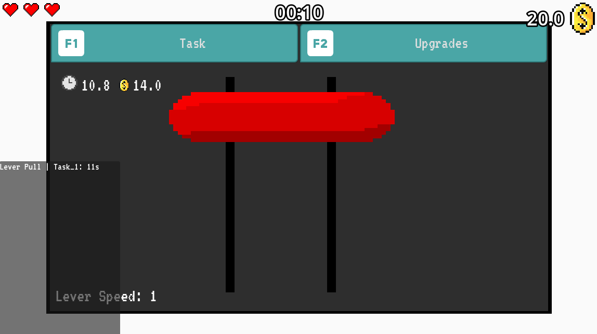
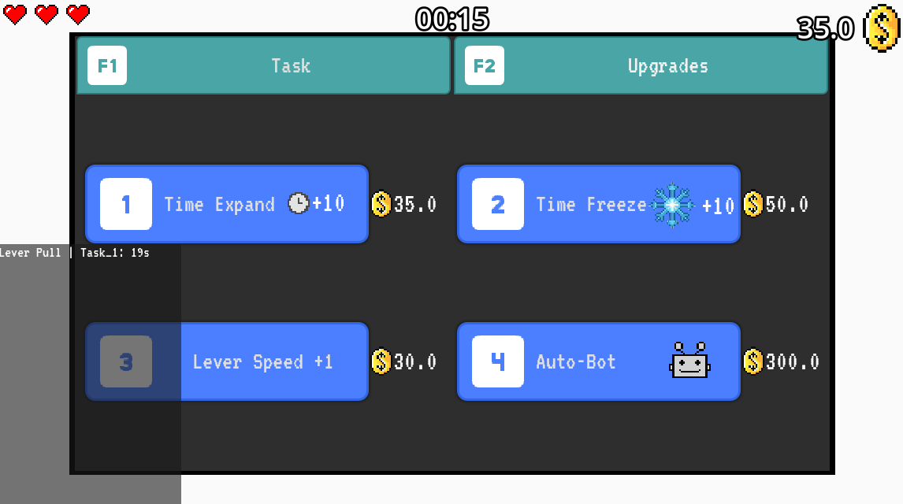
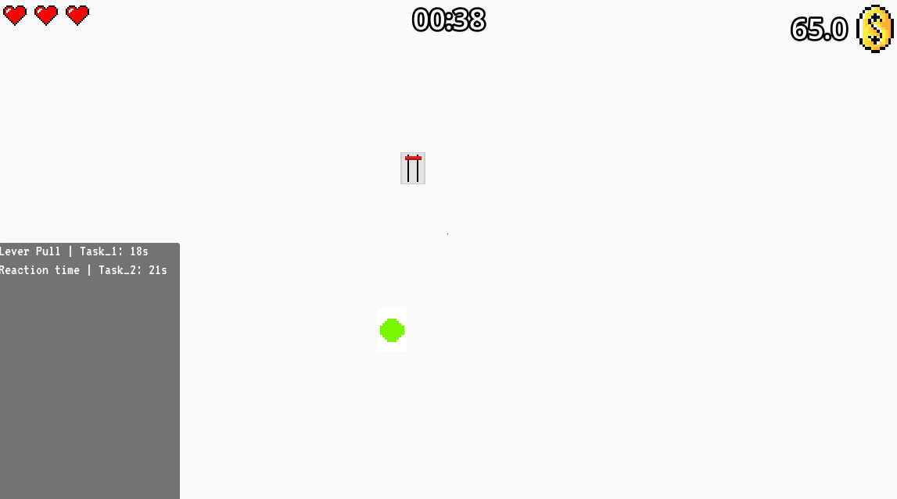

# ⏱️ Tick Task  

A minimalist yet challenging puzzle game built in **Godot 4.4.1**, designed around time pressure, upgrades, and survival mechanics.  
Players must complete a growing list of tasks while balancing upgrades, freezes, and autobots to survive as long as possible.  
Lose all 3 lives, and the run ends — but how far can you push your score?  

---

## 📖 Project Information  

- **Developer:** Omar Ashraf Mahmoud  
- **College:** Zewail City University  
- **Major:** Data Science & Artificial Intelligence (DSAI)  
- **College ID:** 202400725  
- **Publish Date:** 21 July 2025  
- **Personal Email:** omar.ashraf.hamed2017@gmail.com  
- **College Email:** s-omar.amahmoud@zewailcity.edu.eg  

---

## 🎮 Play the Game  

- **Itch.io Profile:** [astronial.itch.io](https://astronial.itch.io/)  
- **Game Download (.exe):** [Tick Task on Itch.io](https://astronial.itch.io/tick-task)  

---

## 🛠️ Features  

- ⏳ **Time Pressure:** Balance tasks against a ticking clock.  
- 🔄 **Upgrades:** Extend time, freeze, or deploy autobots to keep up.  
- 💀 **3-Lives System:** The game only ends when all lives are lost.  
- 💰 **Dynamic Economy:** Coins, scaling costs, and strategic purchases.  
- 📊 **Run Summary:** Track upgrades purchased, coins spent/earned, tasks completed, and more.  
- 🎵 **Dynamic Music:** Calming intro track that grows more intense as lives are lost.  

---

## ⚙️ Tech Details  

- **Engine:** Godot 4.4.1  
- **Language:** GDScript  
- **Platform:** Windows (exported .exe available on Itch.io)  

---

## 🏆 Scoring System  

- ⏱️ **Total Time Survived** – longer runs = higher score.  
- ✅ **Tasks Completed** – every task pushes the score higher.  
- 💰 **Coins Left Over** – efficiency is rewarded.  

---

## 📸 Screenshots

Here are some in-game captures:

---

## 📂 Repository Structure

- **Audio/** – Soundtracks, effects, and ambient sounds  
- **Distractions/** – Scenes and assets for in-game distractions  
- **Main Scenes/** – Core game scenes (menu, main loop, etc.)  
- **Others/** – Miscellaneous assets/resources  
- **Scripts/** – GDScript files controlling the game logic  
- **Sprites/** – All visual assets (textures, icons, sprites)  
- **Task Scenes/** – Scenes for individual tasks/puzzles  
- **export_presets.cfg** – Godot export settings  
- **README.md** – Project documentation  

---

## 🎥 Game Trailer

Check out the official trailer for the game!  

